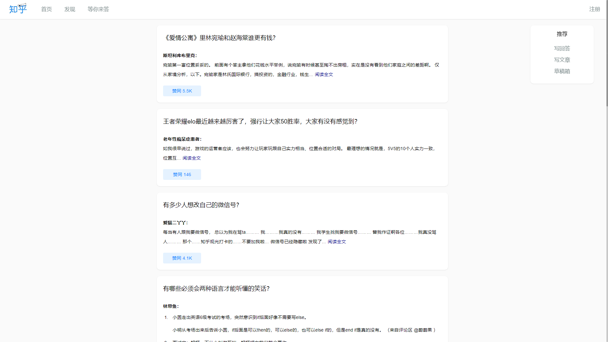
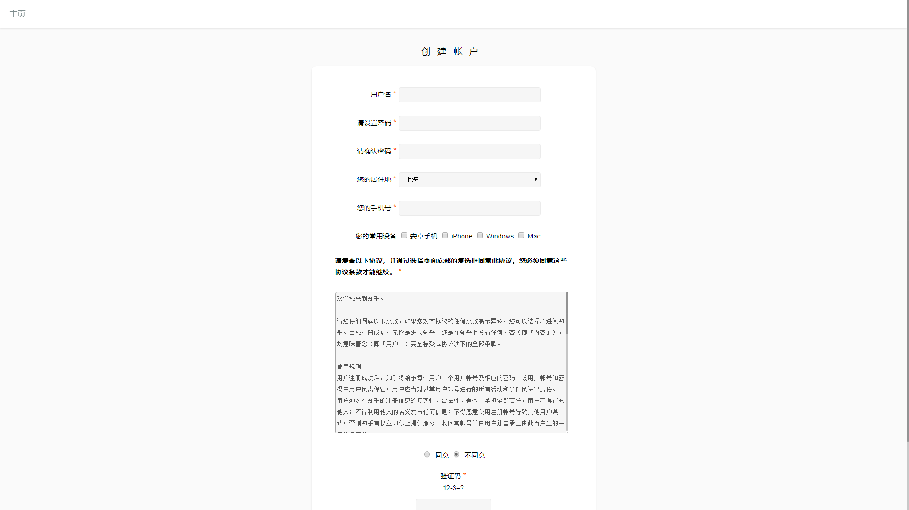
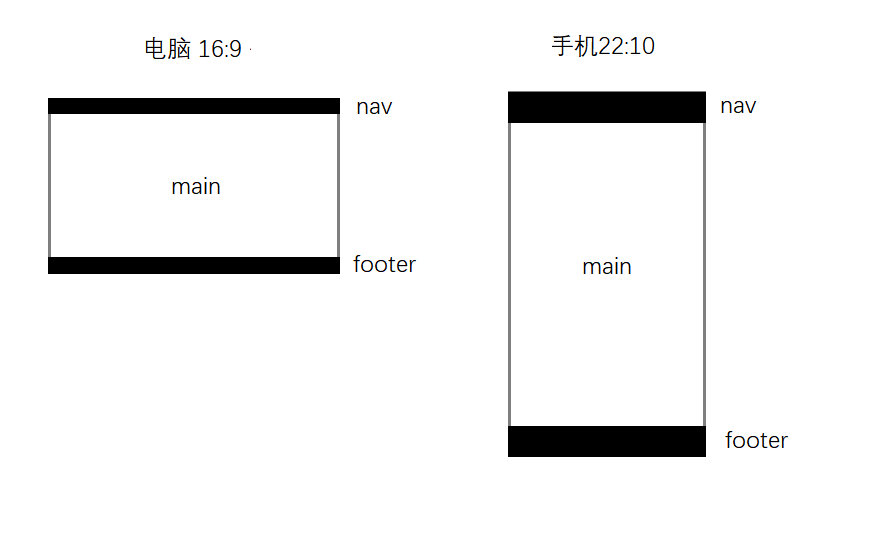
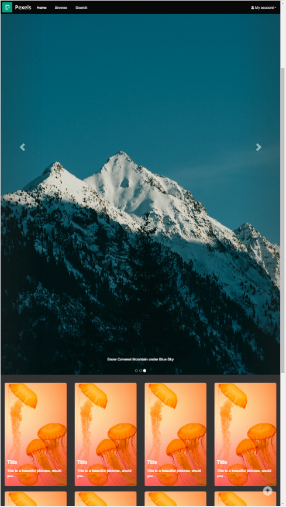
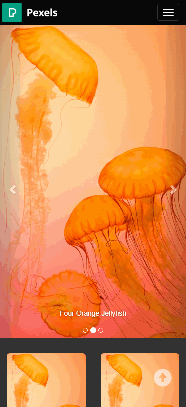

# 2020 web 应用基础 lab 笔记

- sorces: [fdu-19ss-web-lab](https://github.com/fudansswebfundamental/fdu-19ss-web-lab)

## lab0

- 实验步骤：略
- 参考
  - [Git 教程 - 廖雪峰](https://www.liaoxuefeng.com/wiki/896043488029600)
  - [常用 Git 命令清单 - 阮一峰](http://www.ruanyifeng.com/blog/2015/12/git-cheat-sheet.html)
- git 常用指令
  |指令|作用|
  |:-|:-|
  |`git clone [url]`|从仓库克隆到本地|
  |`git add [fileName/--all]`|添加到暂存区|
  | `git commit -m "[comment]"`|添加到本地仓库|
  | `git push`|提交到远程仓库|
  | `git fetch [remote]`|从远程仓库取文件|
  | `git merge [branch]`|取回来的与本地仓库合并|
  | `git push [remote] [branch]`|=fetch+merge|

## lab1

- 参考

  - [git 如何与原始仓库同步](https://blog.csdn.net/libing403/article/details/51729744)
  - [git 远程连接由 http 换成 ssh](https://blog.csdn.net/u013983033/article/details/89393567)

- 无意义占位符

  ```markdown
  Lorem ipsum dolor sit amet, consectetaur adipisicing elit, sed do eiusmod tempor incididunt ut labore et dolore magna aliqua. Ut enim ad minim veniam, quis nostrud exercitation ullamco laboris nisi ut aliquip ex ea commodo consequat. Duis aute irure dolor in reprehenderit in voluptate velit esse cillum dolore eu fugiat nulla pariatur. Excepteur sint occaecat cupidatat non proident, sunt in culpa qui officia deserunt mollit anim id est laborum Et harumd und lookum like Greek to me, dereud facilis est er expedit distinct. Nam liber te conscient to factor tum poen legum odioque civiuda. Et tam neque pecun modut est neque nonor et imper ned libidig met, consectetur adipiscing elit, sed ut labore et dolore magna aliquam.
  ```

- 转义字符（发现 markdown 也会转义，于是用代码符号括了起来）

  | 字符 | 十进制  | 转义字符 |
  | :--: | :-----: | :------: |
  |  "   | `&#34;` | `&quot;` |
  |  &   | `&#38;` | `&amp;`  |
  |  <   | `&#60;` |  `&lt;`  |
  |  >   | `&#62;` |  `&gt;`  |

## lab2

- `.gitignore` 👉 [Git 忽略提交部分文件](https://www.jianshu.com/p/74bd0ceb6182)

- **JavaScript RegExp**

  - 一些样例：[html5pattern](http://html5pattern.com/)

  - 参考文章：[Form Validation Part 1: Constraint Validation in HTML | CSS-Tricks](https://css-tricks.com/form-validation-part-1-constraint-validation-html/)

  - 在线测试：[菜鸟工具](https://c.runoob.com/front-end/854)

    | 符号      | 含义                                                                                     | 示例                                                                                           |
    | :-------- | :--------------------------------------------------------------------------------------- | :--------------------------------------------------------------------------------------------- |
    | [xyz]     | 字符集合，匹配 [] 所包含的任意一个字符                                                   | '[abc]' 可以匹配 "plain" 中的 'a'                                                              |
    | [^xyz]    | 负值字符集合，匹配 [] 未包含的任意字符                                                   | 例如， '[^abc]' 可以匹配 "plain" 中的'p'、'l'、'i'、'n'                                        |
    | [a-z]     | 字符范围，匹配指定范围内的任意字符                                                       | 例如，'[a-z]' 可以匹配 'a' 到 'z' 范围内的任意小写字母字符                                     |
    | [^a-z]    | 负值字符范围，匹配任何不在指定范围内的任意字符                                           | 例如，'[^a-z]' 可以匹配任何不在 'a' 到 'z' 范围内的任意字符                                    |
    | x \| y    | 匹配 x 或 y                                                                              | 例如，'z\|food' 能匹配 "z" 或 "food"，'(z\|f)ood' 则匹配 "zood" 或 "food"                      |
    | \         | 将下一个字符标记为一个特殊字符                                                           | 'n' 匹配字符 "n" '\n' 匹配一个换行符，序列 '\\\\' 匹配 "\\" 而 "\\(" 则匹配 "("                |
    | .         | 匹配除换行符（\n、\r）之外的任何单个字符                                                 | 要匹配包括 '\n' 在内的任何字符，请使用"(.                                                      | \n)"的模式 |
    | {n,m}     | n <= m，最少匹配 n 次且最多匹配 m 次                                                     | "o{1,3}" 将匹配 "fooooood" 中的前三个 o                                                        |
    | {n}       | n 是一个非负整数                                                                         | 匹配确定的 n 次                                                                                |
    | {n,}      | n 是一个非负整数                                                                         | 至少匹配 n 次                                                                                  |
    | +         | 匹配前面的子表达式一次或多次                                                             | 等价于 {1,}                                                                                    |
    | \*        | 匹配前面的子表达式零次或多次                                                             | 等价于 {0,}                                                                                    |
    | ?         | 匹配前面的子表达式零次或一次                                                             | 等价于 {0,1}                                                                                   |
    | special ? | 当该字符紧跟在任何一个其他限制符 (\*, +, ?, {n}, {n,}, {n,m}) 后面时，匹配模式是非贪婪的 | 对于字符串 "oooo"，'o+?' 将匹配单个 "o"，而 'o+' 将匹配所有 'o'                                |
    | ^         | 匹配文本的开头                                                                           | [a-z] 可以用来匹配任意位置上的小写字母: "...a..."；^[a-z] 只能匹配以小写字母为行首的行: "a..." |
    | \$        | 匹配文本的结束                                                                           | [a-z]$ 只能匹配以小写字母为行尾的行: "...a"；^[a-z]$ 只能匹配只有一个小写字母的行: "a"         |

- `name` 和 `id`

  - `name` 独特作用
    - `name` 传递 `form` 提交的值
    - `<input type='radio'>` 根据 **相同的** `name` 属性实现单选实现（事先设置 `checked` 以实现必选）
    - `map` 中分布式相应图

- `form` 表单

  - 多选框`checkbox`

    ```html
    <form>
      <p>您的常用设备</p>

      <input type="checkbox" name="device" id="Android" value="Android" />
      <label for="Android">安卓手机</label>

      <input type="checkbox" name="device" id="iPhone" value="iPhone" />
      <label for="iPhone"> iPhone </label>

      <input type="checkbox" name="device" id="Windows" value="Windows" />
      <label for="Windows"> Windows </label>

      <input type="checkbox" name="device" id="Mac" value="Mac" />
      <label for="Mac"> Mac </label>
    </form>
    ```

  - `label`使用方法：`for` 属性与表单元素的 `id` 属性绑定 ~~（`label` 的 `form` 属性似乎没用 😶）~~

  - `readonly` 和 `disable` 区别

    |          |                    `readonly`                    |  `disable`   |
    | :------: | :----------------------------------------------: | :----------: |
    |   外观   |                      无变化                      |  文本框变灰  |
    | 作用对象 | `<input type = "text/password">` 和 `<textarea>` | 所有表单元素 |
    |   数据   |                      会传值                      |    不传值    |

  - 获得 `password` 密码：`document.getElementById("password").value`

  - 获得 `text` 内容： `document.getElementById("name").innerHTML`

- **[CSS 选择器](https://www.runoob.com/cssref/css-selectors.html)**

  - 斑马纹

    ```css
    tr:nth-child(odd) {
      background-color: #f5f5f5;
    }

    tr:nth-child(even) {
      background-color: #fff;
    }
    ```

- HTML DOM

  - DOM 是 Document Object Model（文档对象模型）的缩写
  - **Document** 对象代表网页
  - 在 HTML DOM 中，所有事物都是节点。DOM 是被视为节点树的 HTML。  
    
  - 注：`<title>DOM 教程</title>`，元素节点 `<title>`，包含值为 "DOM 教程" 的**文本节点**，可通过节点的 innerHTML 属性来访问文本节点的值。
  - HTML DOM 方法

    | 方法                       | 描述                                             | 备注                                                         |
    | :------------------------- | :----------------------------------------------- | :----------------------------------------------------------- |
    | `getElementById()`         | 返回带有指定 ID 的元素                           |
    | `getElementsByTagName()`   | 返回包含带有指定标签名称的所有元素的**节点数组** | `.length` 属性定义节点列表中节点的数量（或者某元素子节点数） |
    | `getElementsByClassName()` | 返回包含带有指定类名的所有元素的**节点数组**     |
    | `appendChild()`            | 插入新的子节点（元素）                           |
    | `removeChild()`            | 删除子节点（元素）                               | 或者直接用`remove()`                                         |
    | `replaceChild()`           | 替换子节点。                                     |
    | `insertBefore()`           | 在指定的子节点前面插入新的子节点                 | `element.insertBefore(inSertEl, originEle);`                 |
    | `createAttribute()`        | 创建属性节点                                     |
    | `createElement()`          | 创建**元素节点**                                 |
    | `createTextNode()`         | 创建**文本节点**                                 |
    | `getAttribute()`           | 返回指定的属性值                                 |
    | `setAttribute()`           | 把指定属性设置或修改为指定的值                   |
    | `write()`                  | 写入文本                                         | 不换行，`writeln()`要换行                                    |

  - HTML DOM 属性

    | 属性          | 描述                                 | 备注                                                                                                 |
    | :------------ | :----------------------------------- | :--------------------------------------------------------------------------------------------------- |
    | `innerHTML`   | 节点（元素）的文本值                 |
    | `parentNode`  | 节点（元素）的父节点                 | DOM 不能在不引用父元素的情况下删除某个元素                                                           |
    | `childNodes`  | 节点（元素）的子节点**们**           |
    | `attributes`  | 节点（元素）的属性节点               |
    | `firstChild`  | 可用于访问元素的文本                 |
    | `nodeValue`   | 根据节点的类型设置或返回节点的值     | 想返回元素的文本，返回的是文本节点的节点值（`element.childNodes[0].nodeValue`）（对 `<input>` 无效） |
    | `value`       |                                      | 元素的值                                                                                             |
    | `textContent` | 属性设置或者返回指定节点的文本内容。 | 这个属性同样可以返回所有子节点的文本                                                                 |

  - 改变 HTML 样式：`document.getElementById("p2").style.fontFamily="Arial";`

  - HTML DOM 事件

    | 名称          | 描述                   | 备注 |
    | :------------ | :--------------------- | :--- |
    | `onload`      | 用户进入               |
    | `onunload`    | 离开页面               |
    | `onchange`    | 常用于输入字段的验证   |
    | `onmouseover` | 鼠标指针移动到元素     |
    | `onmouseout`  | 鼠标指针离开元素       |
    | `onmousedown` | 当某个鼠标按钮被点击时 |
    | `onclick`     | 鼠标点击完成           |
    | `onmouseup`   | 鼠标按钮被松开         |

  - 获取 HTML 中的元素：[Document](https://developer.mozilla.org/zh-CN/docs/Web/API/Document)

  - [HTML DOM Event 对象](https://www.w3school.com.cn/jsref/dom_obj_event.asp)

  - 冒泡 & 捕获
    - 在 HTML DOM 中有两种事件传播的方法：冒泡和捕获。
    - 事件传播是一种定义当发生事件时元素次序的方法。假如 <div> 元素内有一个 <p>，然后用户点击了这个 <p> 元素，应该首先处理哪个元素“click”事件？
    - 在冒泡中，最内侧元素的事件会首先被处理，然后是更外侧的：首先处理 <p> 元素的点击事件，然后是 <div> 元素的点击事件。
    - 在捕获中，最外侧元素的事件会首先被处理，然后是更内侧的：首先处理 <div> 元素的点击事件，然后是 <p> 元素的点击事件。
    - 在 addEventListener() 方法中，你能够通过使用“useCapture”参数来规定传播类型：
    - addEventListener(event, function, useCapture);
    - 默认值是 false，将使用冒泡传播，如果该值设置为 true，则事件使用捕获传播。

- 其他

  - `<select>` 选中元素：`.selectedIndex`
  - 表格内容对齐属性 align 和 vAlign
  - 一个好看的渐变色

    ```css
    /* 相当于一个剪影，文字部分透出了背景的渐变，因为无法单独设定文字的渐变颜色 */
    background: linear-gradient(90deg, #ff8a00, #e52e71);
    -webkit-background-clip: text;
    -webkit-text-fill-color: transparent; /* or: color: transparent; */
    ```

## lab3

- 设计文档

  - 主页

    - 导航栏，宽度 100%，固定在页面顶端

      ```css
      header {
        position: fixed;
        width: 100%;
        top: 0;
      }
      ```

    - 侧边栏，固定在右侧

      ```css
      main aside {
        box-shadow: 0 1px 3px rgba(26, 26, 26, 0.1);
        background-color: white;
        border-radius: 10px;
        position: fixed;
        right: 20px;
      }
      ```

    - 文章，水平居中

      ```css
      main article {
        width: 50vw;
        margin-right: 25vw;
      }
      ```

  - 注册页面的导航栏同主页

- 最后效果

  - 主页

    

  - 注册页

    

- 细节

  - 每段最后添加文字

    ```css
    ... ::after {
      content: '...';
    }
    ```

    从而减少 html 麻烦

  - 文本溢出换行：`word-wrap: break-word;`

## lab3.5

- JSON

  - 用双引号 "" 和冒号 : 组成键值对，数据在名称/值对中
  - 数据由逗号分隔
  - 大括号保存对象
  - 中括号保存数组

  - 例子

    ```js
    {
      "sites": [
      { "name":"菜鸟教程" , "url":"www.runoob.com" },
      { "name":"google" , "url":"www.google.com" },
      { "name":"微博" , "url":"www.weibo.com" }
      ]
    }
    ```

    ```js
    { "name":"runoob", "alexa":10000, "site":null }
    ```

  - JSON.parse() 方法将数据转换为 JavaScript 对象

    ```js
    var obj = JSON.parse('{ "name":"runoob", "alexa":10000, "site":"www.runoob.com" }');
    ```

  - JSON.stringify() 方法将 JavaScript 对象转换为字符串

    ```js
    var obj = { name: 'runoob', alexa: 10000, site: 'www.runoob.com' };
    var myJSON = JSON.stringify(obj);
    ```

- setInterval

  - 一个计时函数

    HTML

    ```html
    <p id="p1"></p>
    ```

    JS

    ```js
    const p1 = document.getElementById('p1');
    setInterval(function () {
      p1.innerHTML = new Date().toLocaleTimeString();
    }, 1000);
    ```

  - 模拟进度条

    css

    ```css
    #myProgress {
      width: 100%;
      height: 30px;
      position: relative;
      background-color: #fafafa;
    }

    #myBar {
      background-color: #66b1ff;
      width: 0;
      height: 30px;
      position: absolute;
    }
    ```

    html

    ```html
    <div id="myProgress">
      <div id="myBar"></div>
    </div>
    <button onclick="move()">点我</button>
    ```

    js

    ```js
    function move() {
      var elem = document.getElementById('myBar');
      var width = 0;
      var id = setInterval(frame, 10); // 如果时间间隔再短就会有搓顿感
      function frame() {
        if (width === 99.99999999999646) {
          // 神奇的js
          clearInterval(id);
        } else {
          width = width + 0.05;
          elem.style.width = width + '%';
        }
      }
    }
    ```

## lab4

- 学习 [Bootstrap](https://v3.bootcss.com/)

  - 引入

    - 下载源文件
    - 引用 CDN

      ```html
      <!-- 最新版本的 Bootstrap 核心 CSS 文件 -->
      <link
        rel="stylesheet"
        href="https://cdn.jsdelivr.net/npm/bootstrap@3.3.7/dist/css/bootstrap.min.css"
        integrity="sha384-BVYiiSIFeK1dGmJRAkycuHAHRg32OmUcww7on3RYdg4Va+PmSTsz/K68vbdEjh4u"
        crossorigin="anonymous"
      />

      <!-- 注意要先引入jQuery，这是百度的CDN -->
      <script src="https://apps.bdimg.com/libs/jquery/2.1.4/jquery.min.js"></script>

      <!-- 最新的 Bootstrap 核心 JavaScript 文件 -->
      <script
        src="https://cdn.jsdelivr.net/npm/bootstrap@3.3.7/dist/js/bootstrap.min.js"
        integrity="sha384-Tc5IQib027qvyjSMfHjOMaLkfuWVxZxUPnCJA7l2mCWNIpG9mGCD8wGNIcPD7Txa"
        crossorigin="anonymous"
      ></script>
      ```

  - 使用方法——找了复制

    - [组件](https://v3.bootcss.com/components/)
    - [全局 CSS 样式](https://v3.bootcss.com/css/)
    - [JavaScript 插件](https://v3.bootcss.com/javascript/)
    - [在线编辑](https://www.runoob.com/try/bootstrap/layoutit/)
    - [定制 Bootstrap](https://v3.bootcss.com/customize/)

  - 为什么不用 Element UI？

- 设计手册

  - 思路

    

    - nav 固定在页面顶端，且不随页面滚动而变化
    - main 中放置图片—— 切换使用 carousel 传送带
    - footer 位于页面最下面，不满一页也固定在底部

  - 具体实现困难

    - 导航栏固定在顶部，格外添加 top 才能回到顶部（纯 html👍）

      HTML

      ```html
      <!-- 顶部 -->
      <div id="top"></div>

      <!-- 返回顶部按钮 -->
      <a class="back-to-top" href="#top"><span class="glyphicon glyphicon-circle-arrow-up" aria-hidden="true"></span></a>
      ```

    - Bootstrap 没有页脚样式，解决方法：

      HTML

      ```html
      <body class="Site">
        <header>...</header>
        <main class="Site-content">...</main>
        <footer>...</footer>
      </body>
      ```

      CSS

      ```css
      .Site {
        display: flex;
        min-height: 100vh;
        flex-direction: column;
      }
      .Site-content {
        flex: 1;
      }
      ```

    - 收起来的效果

      html

      ```html
      <!-- nav -->
      <nav class="navbar navbar-inverse navbar-fixed-top">
        <div class="container-fluid">
          <!-- 这一部分是用来适配移动端的 -->
          <!-- Brand and toggle get grouped for better mobile display -->
          <div class="navbar-header">
            <!-- data-target 要和下面的id对应 -->
            <button type="button" class="navbar-toggle collapsed" data-toggle="collapse" data-target="#navbar-collapse-1" aria-expanded="false">
              <span class="sr-only">Toggle navigation</span>
              <!-- 这是三条横杠 -->
              <span class="icon-bar"></span>
              <span class="icon-bar"></span>
              <span class="icon-bar"></span>
            </button>
            <a class="navbar-brand" href="https://www.pexels.com/"></a>
          </div>

          <!-- Collect the nav links, forms, and other content for toggling -->
          <div class="collapse navbar-collapse" id="navbar-collapse-1">
            <ul class="nav navbar-nav nav-pills">
              <li class="active">
                <a href="index.html">Home <span class="sr-only">(current)</span></a>
              </li>
              <li><a href="src/html/browse.html">Browse</a></li>
              <li><a href="src/html/search.html">Search</a></li>
            </ul>
            <ul class="nav navbar-nav nav-pills navbar-right">
              <li role="presentation" class="dropdown">
                <a class="dropdown-toggle" data-toggle="dropdown" href="#" role="button" aria-haspopup="true" aria-expanded="true"
                  ><i class="fa fa-user"></i> My account<span class="caret"></span
                ></a>
                <ul class="dropdown-menu">
                  <li>
                    <a href="src/html/upload.html"><i class="fa fa-upload"></i> Upload</a>
                  </li>
                  <li>
                    <a href="src/html/myUpload.html"><i class="fa fa-photo"></i> My Photo</a>
                  </li>
                  <li>
                    <a href="src/html/favorite.html"><i class="fa fa-heart"></i> My Favorite</a>
                  </li>
                  <li role="separator" class="divider"></li>
                  <li>
                    <a href="src/html/login.html"><i class="fa fa-sign-in"></i> Log In</a>
                  </li>
                </ul>
              </li>
            </ul>
          </div>
          <!-- /.navbar-collapse -->
        </div>
        <!-- /.container-fluid -->
      </nav>
      ```

    - 六栏 → 四栏 → 两栏

      这里是用了栅栏参数 col-md-3 col-xs-6 col-lg-2 的效果

      html

      ```html
      <div class="col-md-3 col-xs-6 col-lg-2 onePic">
        <a href="#">
          
        </a>
        <div class="caption">
          <h4>Tittle</h4>
          <p>This is a beautiful pictures, would you...</p>
        </div>
      </div>
      ```

  - 最后效果

    - roted FHD

      

    - FHD

      

    - phone

      

- jQuery

  - DOM 操作
    | 选择器 | 方法 |
    | --- | --- |
    | id="intro" | `var myElement = $("#id01");` |
    | `<p>` 元素 | `var myElements = $("p");` |
    | class="intro" | `var myElements = $(".intro");` |
    | `<p class="intro">` | `var myElements = $("p.intro");` |

  - 方法
    | 方法 | 代码 |
    | --- | --- |
    | 设置 HTML 元素的内部文本 | `myElement.text("Hello China!");` |
    | 获取 HTML 元素的内部文本 | `var myText = myElement.text();` |
    | 设置元素的 HTML 内容 | `var myElement.html("<p>Hello World</p>");` |
    | 获取元素的 HTML 内容 | `var content = myElement.html();` |
    | 隐藏一个 HTML 元素 | `myElement.hide();` |
    | 显示一个 HTML 元素 |`myElement.show();` |
    | 更改 HTML 元素的字体尺寸 | `myElement.css("font-size","35px");` |
    | 删除 HTML 元素 |`$("#id").remove();`|
    | 获取父元素 | `var myParent = myElement.parent();`|

## lab5

见 [lab5 设计文档](./lab5/lab5设计文档%20.md)

## lab6

见 [lab6 设计文档](./lab6/lab6设计文档.md)

## lab7

见 [lab7 设计文档](./lab7/lab7设计文档.md)

## lab8

见 [lab8 设计文档](./lab8/lab8设计文档.md)

## lab9

skipped

## lab10

see [lab10doc.md](./lab10/lab10doc.md)

## lab11

see [lab11doc.md](./lab11/lab11doc.md)