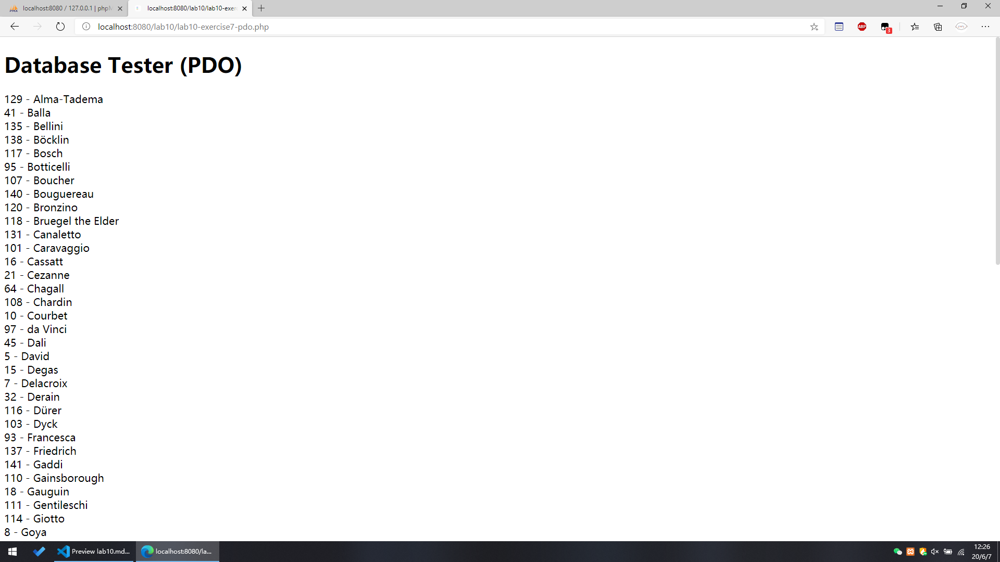
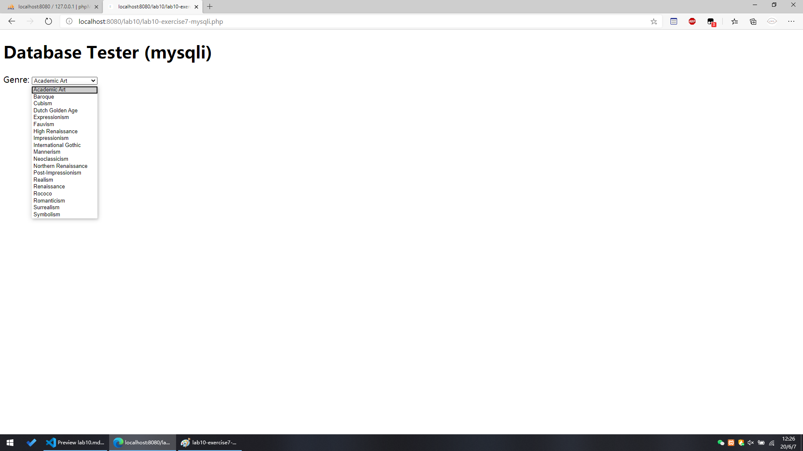
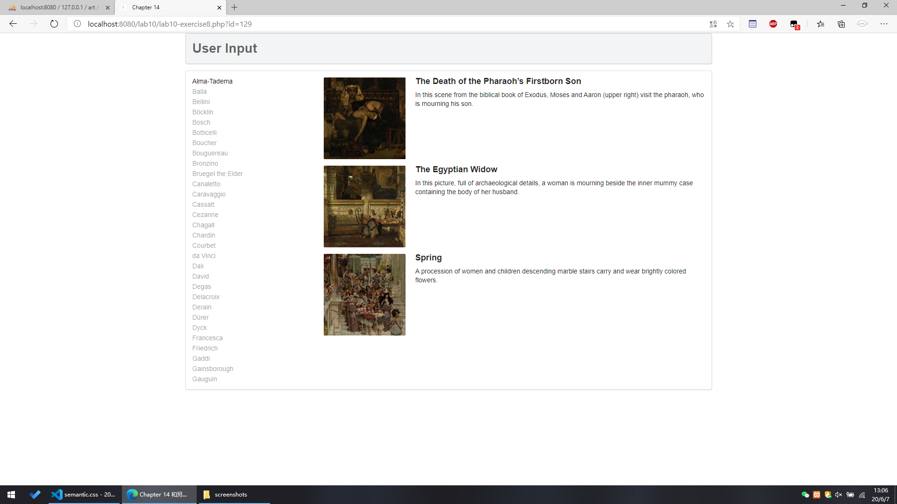
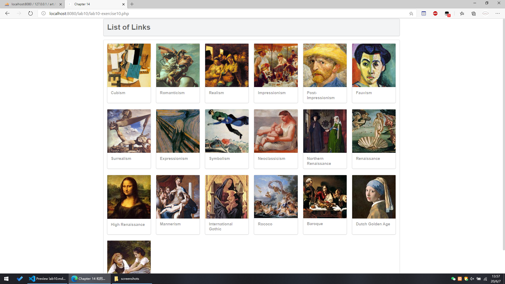

# lab10 设计文档

- **姓名：胡彧锋**

- **学号：18307130207**

> Notice: all functions are explained in explanatory note. -> //

## Exercise1 ~ Exercise6

skiped

## Exercise7

1. `require_once`: require a file and only require once, so it can use daa in 'config.php'

   ```php
   <?php require_once('config.php'); ?>
   ```

2. use PDO

   see [PDO](https://www.php.net/manual/zh/book.pdo.php)

   

   ```php
    <?php
    try {
      // create a PDO object
      $pdo = new PDO(DBCONNSTRING, DBUSER, DBPASS);

      // set PDO::ATTR_ERRMODE (err report) PDO::ERRMODE_EXCEPTION (throw exceptions)
      $pdo->setAttribute(PDO::ATTR_ERRMODE, PDO::ERRMODE_EXCEPTION);

      // a sql query command
      // this will return all data in table artists order by lastName
      $sql = "select * from Artists order by LastName";
      $result = $pdo->query($sql);

      // echo result
      // each line is form: ArtistID - LastName
      while ($row = $result->fetch()) {
        echo $row['ArtistID'] . " - " . $row['LastName'] . "<br/>";
      }

      // make PDO null, so it can be cleared
      $pdo = null;
    } catch (PDOException $e) {

      // if fail to create a PDO object or sql command fail
      // the proceess is terminated, and print error message
      die($e->getMessage());
    }
    ?>
   ```

3. use mysqli

   see [mysqli](https://www.php.net/manual/zh/book.mysqli.php)

    

   ```php
    <?php

    // use mysqli_connect to create a connection
    $connection = mysqli_connect(DBHOST, DBUSER, DBPASS, DBNAME);

    // if error, terminate
    if (mysqli_connect_errno()) {
      die(mysqli_connect_error());
    }

    // a sql command
    // this will return all data in table Genres order by GenreName
    $sql = "select * from Genres order by GenreName";
    if ($result = mysqli_query($connection, $sql)) {
      // loop through the data
      // add option in select
      while ($row = mysqli_fetch_assoc($result)) {
        echo '<option value="' . $row['GenreID'] . '">';
        echo $row['GenreName'];
        echo "</option>";
      }
      // release the memory used by the result set
      mysqli_free_result($result);
    }
    // close the database connection
    mysqli_close($connection);
    ?>
   ```

## Exercise8

1. screenshot

   

2. `outputArtists()`

   ```php
    <?php
    /*
    Displays the list of artist links on the left-side of page
    */
      function outputArtists()
      {
        try {
          // use PDO to connect to MySQL
            $pdo = new PDO(DBCONNSTRING, DBUSER, DBPASS);
            $pdo->setAttribute(PDO::ATTR_ERRMODE, PDO::ERRMODE_EXCEPTION);

            // limit imply that from 0 to 30, total 30 lists
            // in LastName order
            $sql = "select * from Artists order by LastName limit 0,30";
            $result = $pdo->query($sql);
            while ($row = $result->fetch()) {
              echo '<a href="' . $_SERVER["SCRIPT_NAME"] . '?id=' . $row['ArtistID'] . '" class="';

              // add CSS class active tag
              if (isset($_GET['id']) && $_GET['id'] == $row['ArtistID']) echo 'active ';
              echo 'item">';
              echo $row['LastName'] . '</a>';
            }
            $pdo = null;
        } catch (PDOException $e) {
            die($e->getMessage());
        }
      }
    ?>
   ```

3. `outputPaintings()`

   ```php
   <?php
      /*
      Displays the list of paintings for the artist id specified in the id query string
      */
      function outputPaintings()
      {
        try {
          // if id is set (exist) and larger than 0, means this id is available
            if (isset($_GET['id']) && $_GET['id'] > 0) {

              // use PDO to connect to MySQL
              $pdo = new PDO(DBCONNSTRING, DBUSER, DBPASS);
              $pdo->setAttribute(PDO::ATTR_ERRMODE, PDO::ERRMODE_EXCEPTION);
              $sql = 'select * from Paintings where ArtistId=' . $_GET['id'];
              $result = $pdo->query($sql);

              // output each img
              while ($row = $result->fetch()) {
                  outputSinglePainting($row);
              }

              // clear PDO
              $pdo = null;
            }
        } catch (PDOException $e) {

          // exception, die (terminated)
            die($e->getMessage());
        }
      }
    ?>
   ```

4. `outputSinglePainting()`

   ```php
   <?php
      /*
      Displays a single painting
      */
      function outputSinglePainting($row)
      {
        echo '<div class="item">';
        echo '<div class="image">';

        // add img src
        echo '';
        echo '</div>';
        echo '<div class="content">';
        echo '<h4 class="header">';

        // echo row's Title
        echo $row['Title'];
        echo '</h4>';
        echo '<p class="description">';

        // echo row's Expert
        echo $row['Excerpt'];
        echo '</p>';
        echo '</div>'; // end class=content
        echo '</div>'; // end class=item
      }
   ?>
   ```

## Exercise9

1. screenshot

   

2. `outputPaintings()`

   ```php
   function outputPaintings()
   {
     try {
         if (isset($_GET['id']) && $_GET['id'] > 0) {
           $pdo = new PDO(DBCONNSTRING, DBUSER, DBPASS);
           $pdo->setAttribute(PDO::ATTR_ERRMODE, PDO::ERRMODE_EXCEPTION);

           $sql = 'select * from Paintings where ArtistId=:id';
           $id = $_GET['id'];

           // use PDO::prepare
           $statement = $pdo->prepare($sql);
           $statement->bindValue(':id', $id);
           $statement->execute();

           while ($row = $statement->fetch()) {
               outputSinglePainting($row);
           }
           $pdo = null;
         }
     } catch (PDOException $e) {
         die($e->getMessage());
     }
   }
   ```

3. `PDO::prepare`

   - prepare SQL command and return a PDOStatement Object (PHP 5 >= 5.1.0, PECL pdo >= 0.1.0)

     ```php
     public PDOStatement PDO::prepare ( string $statement [, array $driver_options = array() ] )
     // statement: SQL command
     // driver_options: PDOStatement properties, example: array(PDO::ATTR_CURSOR => PDO::CURSOR_FWDONLY)
     ```

     use `:name` or `?` mark (only on of them), where will be replaced in `PDOStatement::execute()`

   - use `:name`

     ```php
      <?php
      $sql = 'SELECT name, colour, calories FROM fruit WHERE calories < :calories AND colour = :colour';

      $sth = $dbh->prepare($sql, array(PDO::ATTR_CURSOR => PDO::CURSOR_FWDONLY));

      $sth->execute(array(':calories' => 150, ':colour' => 'red'));
      $red = $sth->fetchAll();

      $sth->execute(array(':calories' => 175, ':colour' => 'yellow'));
      $yellow = $sth->fetchAll();
      ?>
     ```

   - use `?`

     ```php
     <?php
     $sth = $dbh->prepare('SELECT name, colour, calories FROM fruit WHERE calories < ? AND colour = ?');

     $sth->execute(array(150, 'red'));
     $red = $sth->fetchAll();

     $sth->execute(array(175, 'yellow'));
     $yellow = $sth->fetchAll();
     ?>
     ```

   - advantage
     - Queries only need to be parsed (or prepared) once, but can be executed multiple times with the same or different parameters. Preprocessing statements use fewer resources and perform faster.
     - The parameters passed to the preprocessing statement do not need to use quotation marks. This can make sure that no SQL injection will occur. (however, if you are still building other parts of the query based on untrusted input, this is still risky)

## Exercise10

1. screenshot

   

2. `outputGenres()`

   ```php
   function outputGenres()
   {
     try {
       // use PDO to connect to MySQL
         $pdo = new PDO(DBCONNSTRING, DBUSER, DBPASS);
         $pdo->setAttribute(PDO::ATTR_ERRMODE, PDO::ERRMODE_EXCEPTION);

         $sql = 'select GenreId, GenreName, Description from Genres Order By GenreID';
         $result = $pdo->query($sql);

         // forEach $result, output $row
         while ($row = $result->fetch()) {
           outputSingleGenre($row);
         }
         $pdo = null;
     } catch (PDOException $e) {
         die($e->getMessage());
     }
   }
   ```

3. `outputSingleGenre($row)`

   ```php
   // output each genre
   function outputSingleGenre($row)
   {
     // a div contains img
     echo '<div class="ui fluid card">';
     echo '<div class="ui fluid image">';
     $img = '';
     echo constructGenreLink($row['GenreId'], $img);
     echo '</div>';
     echo '<div class="extra">';
     echo '<h4>';
     echo constructGenreLink($row['GenreId'], $row['GenreName']);
     echo '</h4>';
     echo '</div>'; // end class=extra
     echo '</div>'; // end class=card
   }
   ```

4. `constructGenreLink($id, $label)`

   ```php
   function constructGenreLink($id, $label)
   {
     // $link = '<a href="genre.php?id=' . $id . '">' . $label . '</a>'
     // so we can click and jump to another page
     $link = '<a href="genre.php?id=' . $id . '">';
     $link .= $label;
     $link .= '</a>';
     return $link;
   }
   ```
