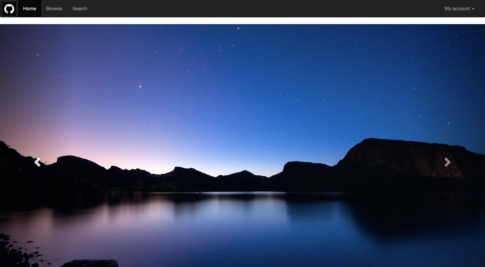

# LAB 4 作业要求

本 LAB 只提供部分代码框架及完成效果图，需要通过结合自己 pj1 的代码进行修改使得最终网页展示效果与我们提供的效果图基本一致（建议有余力的同学多想想怎么能美观）

---

## 作业提交

### 作业提交网址

//github.com/(Your ID)/SOFT130002_lab

e.g. //github.com/mondaylord/SOFT130002_lab

---

### 文件结构

`root` 即直接打开仓库所见的层，或写作 `/lab4`。

```bash
/lab0
/lab1
/lab2
/lab3
/lab4
 /index.html
 /index.css
 /images
 /bootstrap-3.3.7-dist
 /lab4文档.md
 /lab4设计文档.md
```

`index.html` 和`index.css`是<u>**唯二**</u>需要修改的页面，且能使用 bootstrap 提供的的样式尽量使用，减少原生 css 的代码量，主要是<u>**使用 Bootstrap 的 css 样式**</u>。

本 Lab 使用的是**Bootstrap 3**，请到 Bootstrap 官网上(<https://v3.bootcss.com/getting-started/>)查看使用说明。

推荐大家先把 Bootstrap 的文档整个阅览一遍，了解该框架的作用和使用方法，然后应用于本次 lab。官网上也会提供一些网站示例，很多网站也是大家熟悉的网站，大家也可以通过 F12 去查看这些网站的代码。

---

## 作业要求

只需要对 PJ1 的主页进行改进，所有的跳转**无需实现**

导航栏右侧 My account 的下拉菜单如想正常实现，需要在 html 的头部引用 js 文件，建议大家**不要修改**lab4.html 中的 js 文件引入

头文件的引入是会产生覆盖效果的，所以引用顺序请大家留意，如果想修改头部引用的同学请搜索 css 和 js 正确的引用顺序，以防出现无法响应或无法修改布局的情况

布局以大家自己 PJ1 的设计为主，其中需要修改的地方在于将网站的头图变为示例图提供的样式，即**可以滑动查看三张图片**，该功能需要用到 Bootstrap 的 js 插件，大家自己去查看文档（不需要 js 知识）。

建议大家本次 lab 尽可能少用原生 css（除非一些迫不得已的），多尝试一些 Bootstrap 的组件（同时锻炼一下自己的审美能力）。

**需要注意的是：本次 lab 的结果不能直接应用于 PJ1（因为 PJ1 不允许用框架），但是 PJ2 会放开限制，所以大家不要直接在 PJ1 的基础上修改，也不要把这次 lab 当作 PJ1 的主页。**

本次 lab 依然需要撰写一份`设计文档`，主要是介绍你所采取的布局（以 Bootstrap 设计为主），文档中要包含你的**主页截图**，本次文档要求大家学会用**md 格式**来撰写（和助教的文档类似），所有需要引用的图片建议大家也单独放在一个文件夹内（可以将 images 文件夹细分）

---

## 作业效果图

如下：



## DDL

截止时间为 **2020 年 4 月 5 日 23:59:59**

请大家 push 完成后记得去 elearning 上提交，具体提交内容见 elearning 上要求。
