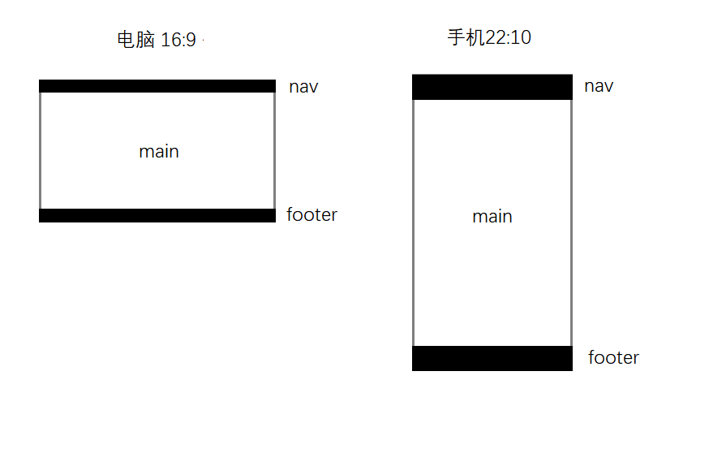
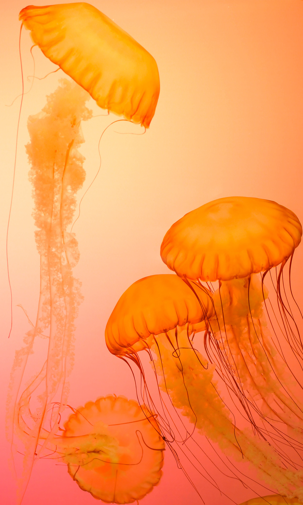
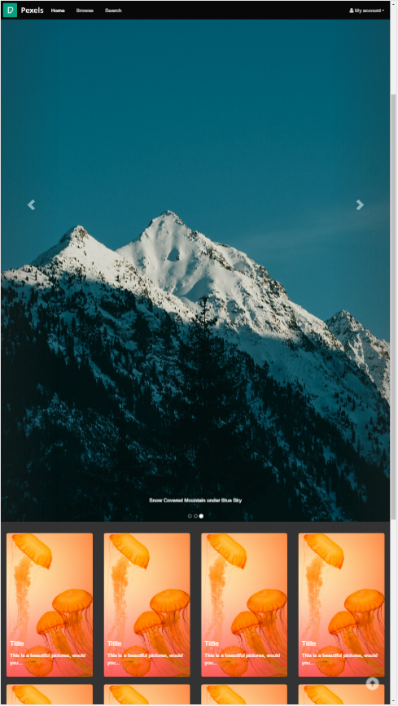
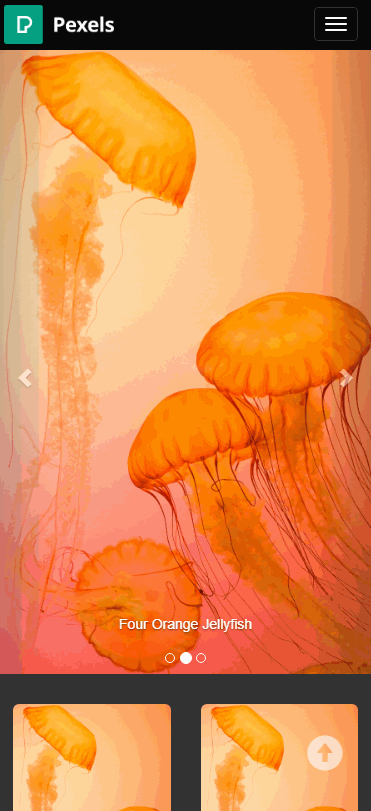

# lab4 设计文档

- **姓名：胡彧锋**

- **学号：18307130207**

- 无版权图片来源：[pexels](https://www.pexels.com/)
- 👉 [未使用 Bootstrap 的主页](https://bathtown.github.io/src/html/home.html)

- 设计手册

  - 思路

    

    - nav 固定在页面顶端，且不随页面滚动而变化
    - main 中放置图片—— 切换使用 carousel 传送带
    - footer 位于页面最下面，不满一页也固定在底部

  - 具体实现困难

    - 导航栏固定在顶部，格外添加 top 才能回到顶部（纯 html👍）

      HTML

      ```html
      <!-- 顶部 -->
      <div id="top"></div>

      <!-- 返回顶部按钮 -->
      <a class="back-to-top" href="#top"><span class="glyphicon glyphicon-circle-arrow-up" aria-hidden="true"></span></a>
      ```

    - Bootstrap 没有页脚样式，解决方法：

      HTML

      ```html
      <body class="Site">
        <header>...</header>
        <main class="Site-content">...</main>
        <footer>...</footer>
      </body>
      ```

      CSS

      ```css
      .Site {
        display: flex;
        min-height: 100vh;
        flex-direction: column;
      }
      .Site-content {
        flex: 1;
      }
      ```

    - 收起来的效果

      html

      ```html
      <!-- nav -->
      <nav class="navbar navbar-inverse navbar-fixed-top">
        <div class="container-fluid">
          <!-- 这一部分是用来适配移动端的 -->
          <!-- Brand and toggle get grouped for better mobile display -->
          <div class="navbar-header">
            <!-- data-target 要和下面的id对应 -->
            <button type="button" class="navbar-toggle collapsed" data-toggle="collapse" data-target="#navbar-collapse-1" aria-expanded="false">
              <span class="sr-only">Toggle navigation</span>
              <!-- 这是三条横杠 -->
              <span class="icon-bar"></span>
              <span class="icon-bar"></span>
              <span class="icon-bar"></span>
            </button>
            <a class="navbar-brand" href="https://www.pexels.com/"></a>
          </div>

          <!-- Collect the nav links, forms, and other content for toggling -->
          <div class="collapse navbar-collapse" id="navbar-collapse-1">
            <ul class="nav navbar-nav nav-pills">
              <li class="active">
                <a href="index.html">Home <span class="sr-only">(current)</span></a>
              </li>
              <li><a href="src/html/browse.html">Browse</a></li>
              <li><a href="src/html/search.html">Search</a></li>
            </ul>
            <ul class="nav navbar-nav nav-pills navbar-right">
              <li role="presentation" class="dropdown">
                <a class="dropdown-toggle" data-toggle="dropdown" href="#" role="button" aria-haspopup="true" aria-expanded="true"
                  ><i class="fa fa-user"></i> My account<span class="caret"></span
                ></a>
                <ul class="dropdown-menu">
                  <li>
                    <a href="src/html/upload.html"><i class="fa fa-upload"></i> Upload</a>
                  </li>
                  <li>
                    <a href="src/html/myUpload.html"><i class="fa fa-photo"></i> My Photo</a>
                  </li>
                  <li>
                    <a href="src/html/favorite.html"><i class="fa fa-heart"></i> My Favorite</a>
                  </li>
                  <li role="separator" class="divider"></li>
                  <li>
                    <a href="src/html/login.html"><i class="fa fa-sign-in"></i> Log In</a>
                  </li>
                </ul>
              </li>
            </ul>
          </div>
          <!-- /.navbar-collapse -->
        </div>
        <!-- /.container-fluid -->
      </nav>
      ```

    - 六栏 → 四栏 → 两栏

      这里是用了栅栏参数 col-md-3 col-xs-6 col-lg-2 的效果

      html

      ```html
      <div class="col-md-3 col-xs-6 col-lg-2 onePic">
        <a href="#">
          
        </a>
        <div class="caption">
          <h4>Tittle</h4>
          <p>This is a beautiful pictures, would you...</p>
        </div>
      </div>
      ```

  - 最后效果

    - roted FHD

      

    - FHD

      

    - phone

      

- 改进
  - 配色无能 🙁
