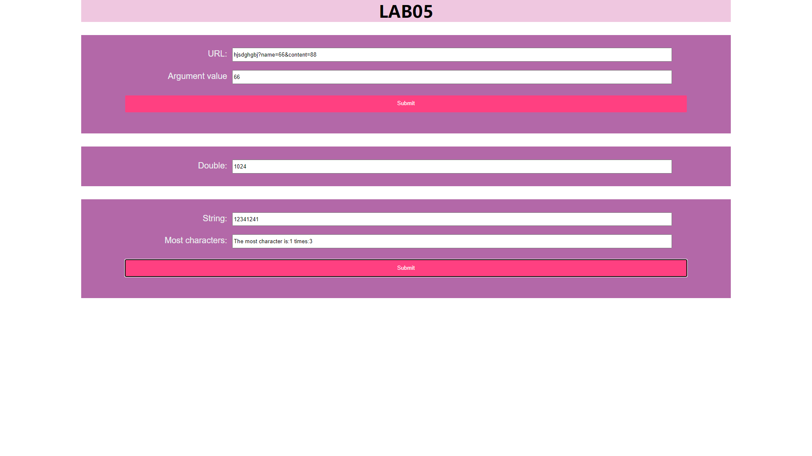
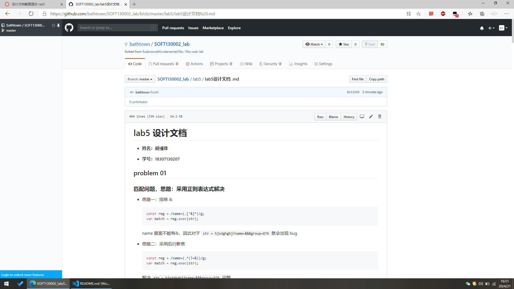

# lab5 设计文档

- **姓名：胡彧锋**

- **学号：18307130207**

## problem 01

### 匹配问题，思路：采用正则表达式解决

- 思路一：排除 &

  ```js
  const reg = /name=(.[^&]*)/g;
  var match = reg.exec(str);
  ```

  name 里面不能有&，因此对于 `str = hjsdghgbj?name=&&&group=876` 就会出现 bug

- 思路二：采用后行断言

  ```js
  const reg = /name=(.*(?=&))/g;
  var match = reg.exec(str);
  ```

  解决 `str = hjsdghgbj?name=&&&group=876` 问题  
  无法匹配无 & 结尾 name 值： `str = hjsdghgbj?name=66`  
  且总是匹配最后的 & ：`str = hjsdghgbj?name=66&content=88&name=65` 匹配结果为 `66&content=88`

- 思路三：非贪婪后行断言？没有 qwq（好难搞……）

## problem 02

### 利用 `new Date().getSeconds() === 0` 获取现在秒数，当到某一整分钟或运行 10 次后停止

```js
if ((new Date().getSeconds() === 0) || (mul.value === "1024"))
  clearInterval(add);
}
```

## problem 03

### 先提取，然后分别计数

```js
const letterArr = most.value.split(''); // 得到字母数组
```

这里注意一点，`array.property` 不如 `array[property]`，后者 property 可以设置为变量，而前者只能为字面值

```js
function arrSameStr() {
  const letterArr = most.value.split('');
  const letterArrLen = letterArr.length;
  // console.log(letterArr);
  let letterWeight = {};
  for (let i = 0; i < letterArrLen; i++) {
    // !! INFO: note that  letterWeight.letterArr[i] is useless and letterWeight[letterArr[i]] is better!
    if (letterWeight.hasOwnProperty(letterArr[i])) letterWeight[letterArr[i]] += 1;
    else letterWeight[letterArr[i]] = 1;
  }
  // console.log(letterWeight);
  var letters = Object.getOwnPropertyNames(letterWeight);
  // console.log(letters);
  const letterLen = letters.length;
  // initialize
  let index = letters[0];
  let max = letterWeight[index];
  for (let j = 1; j < letterLen; j++) {
    if (letterWeight[index] < letterWeight[letters[j]]) {
      index = letters[j];
      max = letterWeight[letters[j]];
    }
  }
  result.value = 'The most character is:' + index + ' times:' + max;
  // console.log(result.value);
}
```

## 相关截图

完成效果



GitHub 截图



## 相关知识

### String Object

1. `length` 属性返回字符串的长度：

   ```js
   var txt = 'ABCDEFGHIJKLMNOPQRSTUVWXYZ';
   var sln = txt.length;
   ```

2. `indexOf()` & `lastIndexOf()` 方法

   - `indexOf()` 返回字符串中指定文本首字母首次出现的位置

     ```js
     var str = "The full name of China is the People's Republic of China.";
     var pos = str.indexOf('China'); // return 17
     ```

   - `lastIndexOf()` 返回字符串中指定文本首字母最后一次出现的位置

     ```js
     var str = "The full name of China is the People's Republic of China.";
     var pos = str.lastIndexOf('China'); // return 51
     ```

   - 如果未找到文本， `indexOf()` 和 `lastIndexOf()` 均返回 -1。

   - 两种方法都接受作为检索**起始位置**的第二个参数，`lastIndexOf()` 方法向后进行检索（从尾到头），这意味着：假如第二个参数是 50，则从位置 50 开始检索，直到字符串的起点。

     ```js
     var str = "The full name of China is the People's Republic of China.";
     var pos = str.indexOf('China', 18); // return 51
     ```

3. `search()` & `match()` 方法搜索特定值的字符串

   - `match()` 方法用于确定原字符串是否匹配某个子字符串，返回一个数组，成员为匹配的第一个字符串。如果没有找到匹配，则返回 null。返回的数组还有 index 属性和 input 属性，分别表示匹配字符串开始的位置和原始字符串。

     ```js
     var matches = 'cat, bat, sat, fat'.match('at');
     matches.index; // 1
     matches.input; // "cat, bat, sat, fat"
     ```

   - `search()` 返回值为匹配的第一个位置，如果没有找到匹配，则返回-1。

   - 可以设置正则表达式

     ```js
     var str = "The full name of China is the People's Republic of China.";
     var pos = str.search('locate'); // return -1
     ```

4. 提取部分字符串

   - 三种方法

     1. `slice(start, end)`

     2. `substring(start, end)`

     3. `substr(start, length)`

   - `slice(start, end)` 在新字符串中返回被提取的部分

     ```js
     var str = 'Apple, Banana, Mango';
     var res = str.slice(7, 13); // res === Banana
     ```

     如果某个参数为负，则从字符串的结尾开始计数（负值位置不适用 IE8 及其更早版本）

     ```js
     var str = 'Apple, Banana, Mango';
     var res = str.slice(-13, -7); // res === Banana
     ```

     如果省略第二个参数，则该方法将裁剪字符串的剩余部分，或者从结尾计数

     ```js
     var res = str.slice(7);
     var res = str.slice(-13);
     ```

   - `substring(start, end)` 方法（无法接受负的索引）

     ```js
     var str = 'Apple, Banana, Mango';
     var res = str.substring(7, 13); // res === Banana
     ```

     如果省略第二个参数，则裁剪字符串的剩余部分

   - `substr(start, length)` 方法（第二个参数规定被提取部分的长度）

     ```js
     var str = 'Apple, Banana, Mango';
     var res = str.substr(7, 6); // res === Banana
     ```

     如果省略第二个参数，则裁剪字符串的剩余部分

     ```js
     var str = 'Apple, Banana, Mango';
     var res = str.substr(7); // res === Banana, Mango
     ```

     如果首个参数为负，则从字符串的结尾计算位置（第二个参数不能为负，因为它定义的是长度）

     ```js
     var str = 'Apple, Banana, Mango';
     var res = str.substr(-5); // res === Mango
     ```

5. `replace()` 方法用另一个值替换在字符串中指定的值：

   ```js
   str = 'Please visit Microsoft!';
   var str2 = str.replace('Microsoft', 'W3School'); // str2 === 'Please visit W3School!'
   ```

   `replace()` 方法不会改变调用它的字符串，它返回的是新字符串。

   默认只替换首个匹配：

   ```js
   str = 'Please visit Microsoft and Microsoft!';
   var str2 = str.replace('Microsoft', 'W3School'); // str2 === 'Please visit W3School and Microsoft!'
   ```

   如需替换所有匹配，请使用正则表达式的 g 标志（用于全局搜索）：

   ```js
   str = 'Please visit Microsoft and Microsoft!';
   var str2 = str.replace(/Microsoft/g, 'W3School'); // str2 === 'Please visit W3School and W3School!'
   ```

6. `toUpperCase()` 方法把字符串转换为大写（不改变原字符串）

   ```js
   var text1 = 'Hello World!';
   var text2 = text1.toUpperCase(); // text2 === 'HELLO WORLD!'
   ```

7. `toLowerCase()` 方法把字符串转换为小写（不改变原字符串）

   ```js
   var text1 = 'Hello World!';
   var text2 = text1.toLowerCase(); // text2 === 'hello world!'
   ```

8. `concat()` 方法连接两个或多个字符串

   ```js
   var text1 = 'Hello';
   var text2 = 'World';
   text3 = text1.concat(' ', text2); // text3 === 'Hello World'
   ```

9. `trim()` 方法删除字符串**两端**的空白符（不会删除之间的空白）

   ```js
   var str1 = ' Hello World! ';
   var str2 = str1.trim(); // str2 === 'Hello World!'
   ```

10. `charAt(position)` & `charCodeAt(position)` 提取字符串字符（**无法改变字符串单个字符的值**）

    - `charAt(position)` 方法返回字符串中指定下标的字符

      ```js
      var str = 'HELLO WORLD';
      str.charAt(0); // H
      ```

    - `charCodeAt(position)` 方法返回字符串中指定索引的字符 unicode 编码

      ```js
      var str = 'HELLO WORLD';
      str.charCodeAt(0); // 72
      ```

11. 可以通过 `split()` 将字符串转换为数组

    ```js
    var txt = 'a b c d e'; // ' '可以是',','|'...
    console.log(txt.split(' ')); // ["a", "b", "c", "d", "e"]
    ```

    如果省略分隔符，返回的数组[0]为整个字符串：

    ```js
    var txt = 'Hello';
    console.log(txt.split('')); // ["Hello"]
    ```

    如果分隔符是 ""，被返回的数组将是间隔单个字符的数组：

    ```js
    var txt = 'Hello';
    console.log(txt.split('')); // ["H", "e", "l", "l", "o"]
    ```

### timer

- `setTimeout()`

  > `var timerId = setTimeout(func, delay);`

  - 第一个参数是函数，第二个参数是要推迟执行的毫秒数

- `setInterval()`

  - **`setInterval` 函数无法`return`**

  - 一个计时函数

    HTML

    ```html
    <p id="p1"></p>
    ```

    JS

    ```js
    const p1 = document.getElementById('p1');
    setInterval(function () {
      p1.innerHTML = new Date().toLocaleTimeString();
    }, 1000);
    ```

  - 模拟进度条

    css

    ```css
    #myProgress {
      width: 100%;
      height: 30px;
      position: relative;
      background-color: #fafafa;
    }

    #myBar {
      background-color: #66b1ff;
      width: 0;
      height: 30px;
      position: absolute;
    }
    ```

    html

    ```html
    <div id="myProgress">
      <div id="myBar"></div>
    </div>
    <button onclick="move()">点我</button>
    ```

    js

    ```js
    function move() {
      var elem = document.getElementById('myBar');
      var width = 0;
      var id = setInterval(frame, 10); // 如果时间间隔再短就会有搓顿感
      function frame() {
        if (width === 99.99999999999646) {
          // 神奇的js
          clearInterval(id);
        } else {
          width = width + 0.05;
          elem.style.width = width + '%';
        }
      }
    }
    ```

### RegExp Object

1. 新建正则表达式

   ```js
   var regex = new RegExp('xyz', 'i');
   // 等价于
   var regex = /xyz/i;
   ```

2. properties

   | property                    | explanation                                                          |
   | --------------------------- | -------------------------------------------------------------------- |
   | RegExp.prototype.ignoreCase | 是否设置了 i 修饰符                                                  |
   | RegExp.prototype.global     | 是否设置了 g 修饰符                                                  |
   | RegExp.prototype.multiline  | 是否设置了 m 修饰符                                                  |
   | RegExp.prototype.flags      | 返回一个字符串，包含了已经设置的所有修饰符，按字母排序               |
   | RegExp.prototype.lastIndex  | 带有 g 修饰符时，可以通过正则对象的 lastIndex 属性指定开始搜索的位置 |
   | RegExp.prototype.source     | 返回正则表达式的字符串形式（不包括反斜杠）                           |

   ```js
   var r = /abc/gim;

   r.ignoreCase; // true
   r.global; // true
   r.multiline; // true
   r.flags; // 'gim'

   var r = /abc/gim;

   r.lastIndex; // 0
   r.source; // "abc"
   ```

3. methods

   | method   | explanation                                             | remark                                |
   | -------- | ------------------------------------------------------- | ------------------------------------- |
   | `test()` | 当前模式是否能匹配参数字符串                            | `/cat/.test('cats and dogs') // true` |
   | `exec()` | 返回匹配结果，成功返回匹配成功的子字符串，否则返回 null |

4. 与其他 methods 联动

   ```js
   // String.prototype.match()
   '_x_x'.match(/x/); // ["x"]
   '_x_x'.match(/y/); // null

   // String.prototype.search()
   '_x_x'.search(/x/);
   // 1

   // String.prototype.replace()
   'aaa'.replace('a', 'b'); // "baa"，只是单个字符串
   'aaa'.replace(/a/, 'b'); // "baa"，正则表达式如果不加g修饰符，就替换第一个匹配成功的值，否则替换所有匹配成功的值。
   'aaa'.replace(/a/g, 'b'); // "bbb"

   // String.prototype.split()
   // 非正则分隔
   'a,  b,c, d'.split(',');
   // [ 'a', '  b', 'c', ' d' ]

   // 正则分隔，去除多余的空格
   'a,  b,c, d'.split(/, */);
   // [ 'a', 'b', 'c', 'd' ]

   // 指定返回数组的最大成员
   'a,  b,c, d'.split(/, */, 2)[('a', 'b')];
   ```

5. 匹配规则

   | symbol      | explanation                                  | remark                                                                  |
   | ----------- | -------------------------------------------- | ----------------------------------------------------------------------- |
   | `[xyz]`     | match [] caontains letters                   | '[abc]' match "plain"'s 'a'                                             |
   | `[^xyz]`    | don't match [] caontains letters             | '[^abc]' match "plain"'s 'p', 'l', 'i', 'n'                             |
   | `[a-z]`     | match a-z                                    |
   | `[^a-z]`    | don't match a-z                              |
   | `x | y`     | match x or y                                 | 'z\|food' match "z" or "food", '(z\|f)ood' match "zood" or "food"       |
   | \           | the next letter is special                   | `'\n'`, `"\\"`, `"\("`...                                               |
   | `.`         | match any letter except `'\n'`, `'\r'`       |
   | `{n,m}`     | n <= m, match at least n times, most m times | "o{1,3}" match "fooooood"'s 3 'o'                                       |
   | `{n}`       | match exactly n times                        |
   | `{n,}`      | match at least n times                       |
   | `+`         | <==> {1,}                                    |
   | `*`         | <==> {0,}                                    |
   | `?`         | <==> {0,1}                                   |
   | `special ?` | not greedy 😁                                | `"oooo".match(/o+?/) // ["0"]` but `"oooo".match(/o+/) // ["oooo"] 'o'` |
   | `^`         | match the beginning                          | `/^[a-z]/` match begin with a-z: a...                                   |
   | `$`         | match the end                                | `/[a-z]$/` match end with a-z: a...                                     |

6. 参考
   - [html5pattern](http://html5pattern.com/)
   - [Form Validation Part 1: Constraint Validation in HTML | CSS-Tricks](https://css-tricks.com/form-validation-part-1-constraint-validation-html/)
   - [菜鸟工具-在线测试](https://c.runoob.com/front-end/854)
   - [RegExp 对象](https://wangdoc.com/javascript/stdlib/regexp.html)
