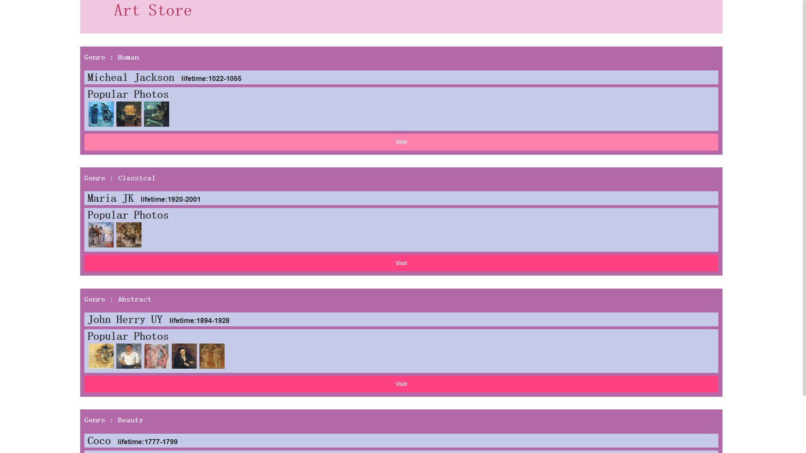
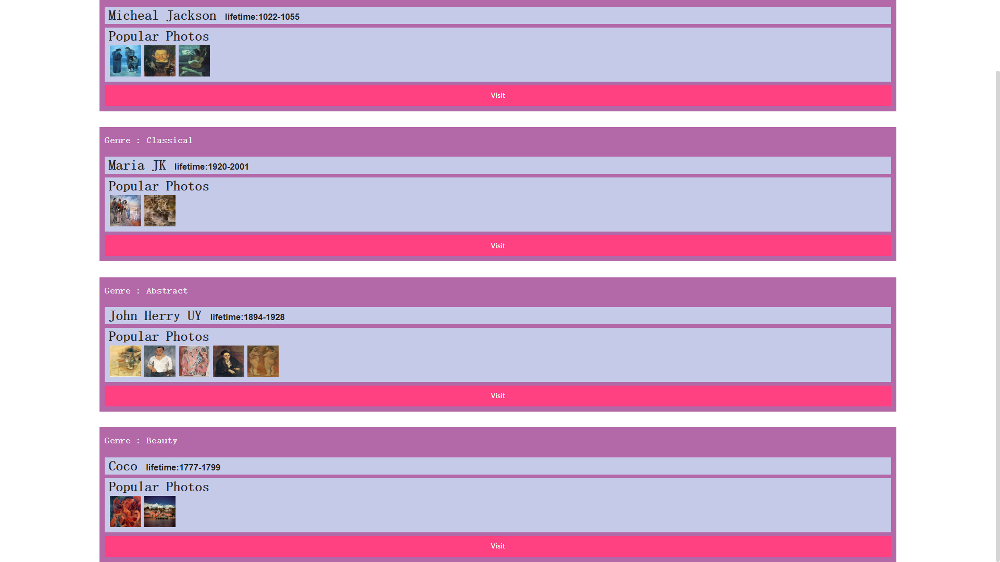
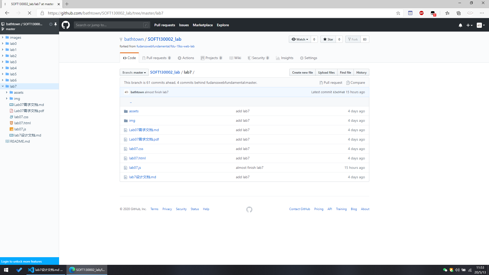

# lab7 设计文档

- **姓名：胡彧锋**

- **学号：18307130207**

## 实现思路

1. 先把每一个基本框 workFrame 搭建出来

   ```js
   const workFrame = document.createElement('div');
   workFrame.className = 'item';

   // 4个组成
   const Genre = document.createElement('h4');
   const authorNameContainer = document.createElement('div');
   const workPhotosContainer = document.createElement('div');
   const workButton = document.createElement('button');

   workFrame.appendChild(Genre);
   workFrame.appendChild(authorNameContainer);
   workFrame.appendChild(workPhotosContainer);
   workFrame.appendChild(workButton);
   ```

2. 再为每个添加效果

   ```js
   authorNameContainer.className = 'inner-box';
   workPhotosContainer.className = 'inner-box';
   workButton.innerText = 'Visit';

   // authorNameContainer 内部
   // 顶多会出现设置display和marginLeft为1em的代码
   const authorName = document.createElement('h3');
   authorName.style.display = 'inline';
   // 与作者名同行的 lifetime 是h5
   const liftime = document.createElement('h5');
   liftime.style.display = 'inline';
   liftime.style.marginLeft = '1em';
   authorNameContainer.appendChild(authorName);
   authorNameContainer.appendChild(liftime);

   // workPhotosContainer 内部
   const photoTitle = document.createElement('h3');
   workPhotosContainer.appendChild(photoTitle);
   ```

3. 插入 flex-container 中

   ```js
   const flexContainer = document.querySelector('.flex-container');

   works.forEach((work) => {
     let workTempt = workFrame.cloneNode(true);

     // 注意①除了Genre后的:左右的空格以及必要的单词间空格，lab7的js里面不会出现设置字体、添加空格什么的代码....
     workTempt.childNodes[0].innerText = 'Genre : ' + work.tips;
     workTempt.getElementsByTagName('h3')[0].innerText = work.author;
     workTempt.getElementsByTagName('h5')[0].innerText = 'lifetime:' + work.lifetime;
     workTempt.getElementsByTagName('h3')[1].innerText = 'Popular Photos';

     let photoTitle = workTempt.getElementsByTagName('h3')[1];
     work.photos.forEach((photoSrc) => {
       let photoImg = document.createElement('img');
       photoImg.className = 'photo';
       photoImg.src = 'img/' + photoSrc;
       photoTitle.parentNode.appendChild(photoImg);
     });

     flexContainer.appendChild(workTempt);
   });
   ```

4. 实现双击效果

   ```js
   document.body.addEventListener('dblclick', () => {
     // ...
   });
   ```

5. 最后效果

   

   

6. GitHub 截图

   

## 相关知识

### DOM

1. DOM 是 Document Object Model（文档对象模型）的缩写

2. 在 HTML DOM 中，所有事物都是节点。DOM 是被视为节点树的 HTML

3. node

   ✋ kinds

   | name               | explanation                                   |
   | ------------------ | --------------------------------------------- |
   | `Document`         | 整个文档树的顶层节点，代表网页                |
   | `DocumentType`     | doctype 标签（比如`<!DOCTYPE html>`）         |
   | `Element`          | 网页的各种 HTML 标签（比如`<body>`、`<a>`等） |
   | `Attr`             | 网页元素的属性（比如 `class="right"`）        |
   | `Text`             | 标签之间或标签包含的文本                      |
   | `Comment`          | 注释                                          |
   | `DocumentFragment` | 文档的片段                                    |

   ✍ properties

   | property                         | explanation                                 | remark                                                       |
   | -------------------------------- | ------------------------------------------- | ------------------------------------------------------------ |
   | `Node.prototype.nodeType`        | return Node's kind                          | is a number                                                  |
   | `Node.prototype.nodeName`        | return Node's name                          |
   | `Node.prototype.nodeValue`       | return Node's value(text, comment and attr) | get element's content, use `element.childNodes[0].nodeValue` |
   | `Node.prototype.textContent`     | return Node's text content                  | including children's text content                            |
   | `Node.prototype.baseURI`         | current URI                                 | if there is `<base>`, return `<base>`                        |
   | `Node.prototype.ownerDocument`   | return document                             |
   | `Node.prototype.nextSibling`     | return next sibling/null                    |
   | `Node.prototype.previousSibling` | return previous sibling/null                |
   | `Node.prototype.parentNode`      | return Node's parent node                   |
   | `Node.prototype.firstChild`      | return Node's firstChild                    |
   | `Node.prototype.lastChild`       | return Node's lastChild                     |
   | `Node.prototype.childNodes`      | return Node's childNodes                    |

   👋 methods

   | method                                | explanation                                            | remark                                  |
   | ------------------------------------- | ------------------------------------------------------ | --------------------------------------- |
   | `Node.prototype.appendChild()`        | append a child at last                                 |
   | `Node.prototype.hasChildNodes()`      | whether has children                                   |
   | `Node.prototype.cloneNode(Boolean b)` | clone a node, b -> whether children nodes              | lose addEventListener & on-func         |
   | `Node.prototype.insertBefore(a, b)`   | insert a before b                                      |
   | `Node.prototype.removeChild()`        |                                                        | remove a: `a.parentNode.removeChild(a)` |
   | `Node.prototype.replaceChild(a, b)`   | replace a with b                                       |
   | `Node.prototype.contains(a)`          | Node is a/Node has a child named a/Node ... child is a |

4. 用于容纳多个节点：NodeList 和 HTMLCollection

   - NodeList 可以包含各种类型的节点
   - HTMLCollection 只能包含 HTML 元素节点

5. document

   - document 对象代表整个文档

     | name                                | explanation                                      | remark                                                       |
     | ----------------------------------- | ------------------------------------------------ | ------------------------------------------------------------ |
     | `document.documentElement`          | `<html>`                                         |
     | `document.body，document.head`      | `<head>` and `<body>`                            |
     | `document.getElementById()`         | 返回带有指定 ID 的元素                           |
     | `document.getElementsByTagName()`   | 返回包含带有指定标签名称的所有元素的**节点数组** | `.length` 属性定义节点列表中节点的数量（或者某元素子节点数） |
     | `document.getElementsByClassName()` | 返回包含带有指定类名的所有元素的**节点数组**     |
     | `document.createAttribute()`        | 创建属性节点                                     |
     | `document.createElement()`          | 创建**元素节点**                                 |
     | `document.createTextNode()`         | 创建**文本节点**                                 |

   - 参考
     - [获取 HTML 中的元素](https://developer.mozilla.org/zh-CN/docs/Web/API/Document)
     - [Document](https://wangdoc.com/javascript/dom/document.html)

6. Element 节点

   ✍ properties

   | property             | explanation                  |
   | -------------------- | ---------------------------- |
   | `Element.value`      | 元素的值，注意是**字符串**   |
   | `Element.innerHTML`  | 节点（元素）的文本值         |
   | `Element.outerHTML`  | 当前元素节点的所有 HTML 代码 |
   | `Element.attributes` | 节点（元素）的属性节点       |
   | `Element.className`  | class 属性                   |
   | `Element.style`      | 行内样式                     |

   👋 methods

   | method                   | explanation                      | remark                                       |
   | ------------------------ | -------------------------------- | -------------------------------------------- |
   | `Element.removeChild()`  | 删除子节点（元素）               | 或者直接用`remove()`                         |
   | `Element.replaceChild()` | 替换子节点。                     |
   | `Element.insertBefore()` | 在指定的子节点前面插入新的子节点 | `element.insertBefore(inSertEl, originEle);` |
   | `Element.getAttribute()` | 返回指定的属性值                 |
   | `Element.setAttribute()` | 把指定属性设置或修改为指定的值   |
   | `Element.click()`        | 点击事件                         |

7. HTML DOM 事件

   | name          | explanation            | remark |
   | ------------- | ---------------------- | ------ |
   | `onload`      | 用户进入               |
   | `onunload`    | 离开页面               |
   | `onchange`    | 常用于输入字段的验证   |
   | `onmouseover` | 鼠标指针移动到元素     |
   | `onmouseout`  | 鼠标指针离开元素       |
   | `onmousedown` | 当某个鼠标按钮被点击时 |
   | `onclick`     | 鼠标点击完成           |
   | `onmouseup`   | 鼠标按钮被松开         |

   - [HTML DOM Event 对象](https://www.w3school.com.cn/jsref/dom_obj_event.asp)

   - 冒泡 & 捕获

     - 在 HTML DOM 中有两种事件传播的方法：冒泡和捕获。
     - 事件传播是一种定义当发生事件时元素次序的方法。假如 `<div>` 元素内有一个 `<p>`，然后用户点击了这个 `<p>` 元素，应该首先处理哪个元素“click”事件？
     - 在冒泡中，最内侧元素的事件会首先被处理，然后是更外侧的：首先处理 `<p>` 元素的点击事件，然后是 `<div>` 元素的点击事件。
     - 在捕获中，最外侧元素的事件会首先被处理，然后是更内侧的：首先处理 `<div>` 元素的点击事件，然后是 `<p>` 元素的点击事件。
     - 在 addEventListener() 方法中，你能够通过使用“useCapture”参数来规定传播类型：
     - `addEventListener(event, function, useCapture);`
     - 默认值是 false，将使用冒泡传播，如果该值设置为 true，则事件使用捕获传播。

### Event

1. EventTarget 接口

   | method                                                          | explanation                                                                      |
   | --------------------------------------------------------------- | -------------------------------------------------------------------------------- |
   | `EventTarget.addEventListener(type, listener[, useCapture])`    | type：事件名称，listener：监听函数，useCapture：捕获阶段                         |
   | `EventTarget.removeEventListener(type, listener[, useCapture])` | 移除的监听函数必须是 addEventListener 方法添加的那个监听函数（匿名函数无法移除） |
   | `EventTarget.dispatchEvent(event)`                              | 调用 event                                                                       |

   - 示例

     ```js
     element.addEventListener('click', listener, { once: true }); // 只执行一次

     para.addEventListener('click', hello, false);
     var event = new Event('click');
     para.dispatchEvent(event); // 触发了click事件
     ```

   - **如果 listener 有 () 则会是一个函数表达式，而不是函数，就会自动执行**

   - 冒泡 & 捕获

     - `<div>` 元素内有一 `<p>`，两者都加上了 `click` 的监听器，然后用户点击了这个 `<p>` 元素
     - 冒泡：**先内后外**
     - 捕获：**先外后内**
     - `addEventListener(event, function, useCapture);` useCapture 默认值是 false，将使用**冒泡传播**

2. 常见事件

   | name        | explanation                                             |
   | ----------- | ------------------------------------------------------- |
   | `load`      | 外部资源加载成功时触发                                  |
   | `change`    | 当`<input>`、`<select>`、`<textarea>`的值发生变化时触发 |
   | `mouseover` | 鼠标指针移动到元素                                      |
   | `mouseout`  | 鼠标指针离开元素                                        |
   | `mousedown` | 当某个鼠标按钮被点击时                                  |
   | `mouseup`   | 鼠标按钮被松开                                          |
   | `click`     | 鼠标点击完成                                            |

   - [HTML DOM Event 对象](https://www.w3school.com.cn/jsref/dom_obj_event.asp)
   - [事件参考](https://developer.mozilla.org/zh-CN/docs/Web/Events)
